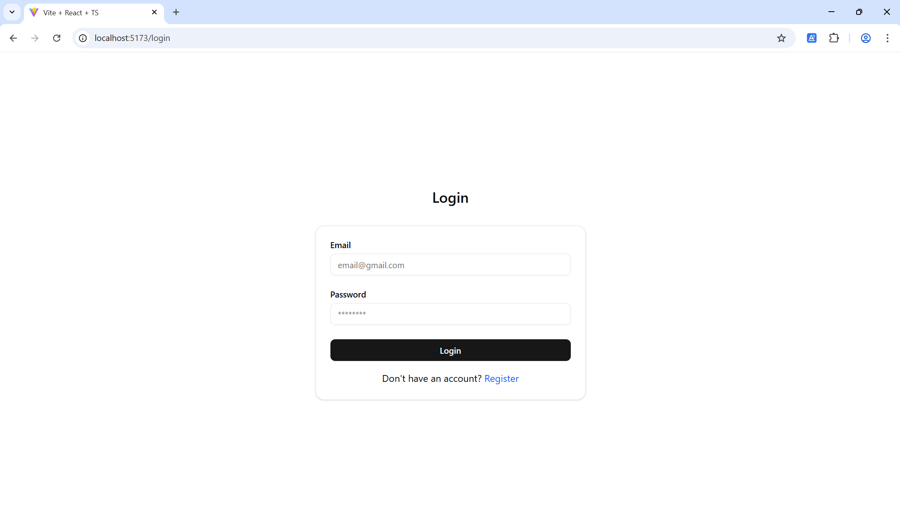
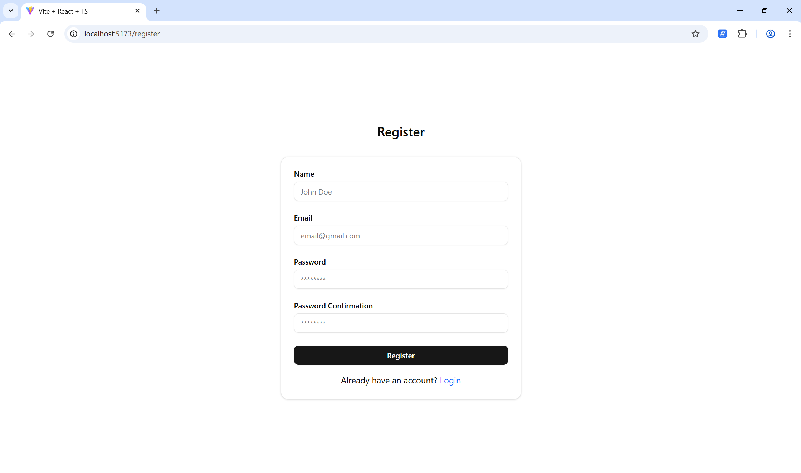
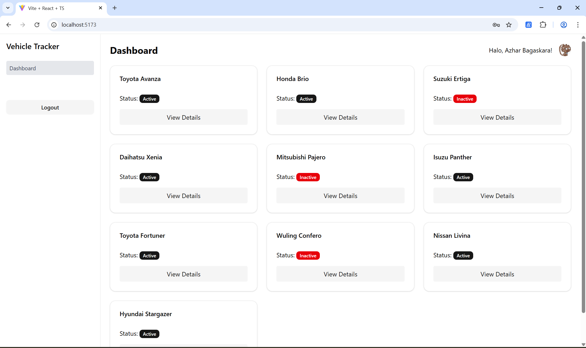
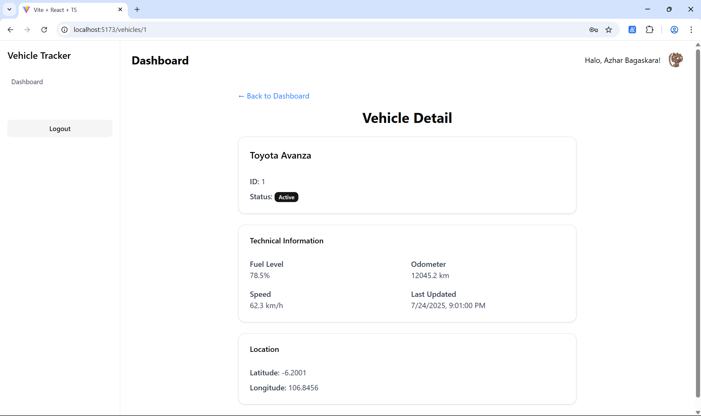

# Vehicle Tracker Dashboard

An intern Take-Home Assignment.

## Project Structure

- **Backend:** Handles API and data processing.
- **Frontend:** User interface for dashboard.

## Feature Implemented
- Frontend: React, TypeScript, Zustand, Tailwind CSS, Shadcn React Router, Axios, TanStack Query.
- Backend: Node.js, Express, JWT Authentication, Prisma ORM.
- Database: PostgreSQL.

## Setup & Run

### Backend

1. Copy the `.env.example` file to `.env`.
2. Configure your database connection URL and fill refresh token and access token secret with your secret values (you can fill with random strings) in `.env` file.
3. Install dependencies and run migrations:

```bash
cd backend

npm install

npx prisma migrate dev

npx prisma db seed

npx prisma generate

npm run dev
```
4. Don't forget to run the database server (PostgreSQL).

The backend server will start on the configured port (default: `http://localhost:8080`).

---

### Frontend

1. Copy the `.env.example` file to `.env`.
2. Configure the API base URL (the backend URL) in `.env` file.
3. Install dependencies and start the development server:

```bash
cd frontend

npm install

npm run dev
```

The frontend will be available at `http://localhost:5432`.

## Some Screenshots

Login Page:


Register Page:


Dashboard Page:


Vehicle Details Page:
